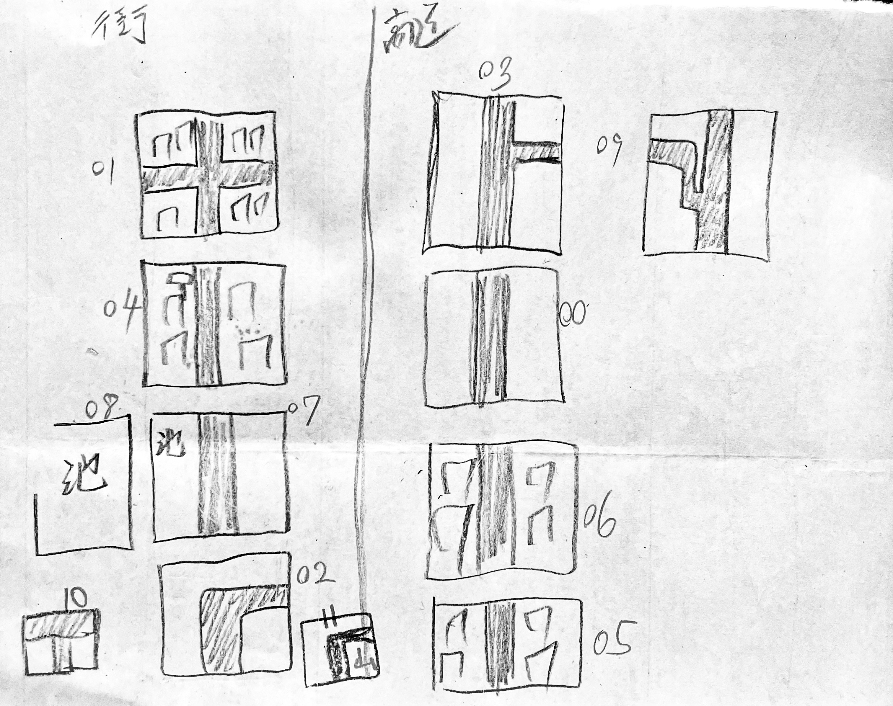

# Driving in the USA　スマホバージョン

> 

> 

> 

> 
  
### アメリカの砂漠道路を走りながら音楽を楽しむ雰囲気系ゲーム。
* アメリカ中西部の砂漠を走るイメージ。 スタン・ハンセン、テリーマン、イージーライダー、西部劇、チャールズ・ブロンソン、、、映画『バグダッドカフェ』（見てない）、『シェルタリングスカイ』など夕日の砂漠イメージから着想。
* 車内音というホワイトノイズ、単純反復作業（まっすぐ走るだけ）、流れる景色、、、禅的なわびさびへの没入を意図した構造である。

イメージ
* https://www.youtube.com/watch?v=XTYLsULsefs&list=RDXTYLsULsefs&start_radio=1
> （↑※シェルタリングスカイの砂漠は北アフリカ）
* https://www.youtube.com/watch?v=oCLpLWcX2cg&list=RDoCLpLWcX2cg&start_radio=1

## 内容・制作情報

### ラジオ
* NHKと米国等のネットラジオをリアルタイムに聴ける。

### 音楽
* 音楽は裏でyoutube接続して音を引っ張ってくる仕組みなので著作権問題をたぶんクリア。
* それゆえ、たまに広告が入る。非公式に広告ブロッカーを推奨。そうしないと曲開始前にCMが入りまくる可能性あり。
* 自前リソースに依存せずyoutubeを使用するので、ほぼ無限にラインナップを増やすことが可能。
* 公式動画、公式音声をなるべく使用している。
* ラインナップは大前提として雰囲気に合致するか否かの基準でピックアップしている。
* 70、80年代を多くしている。平成感、2000年以降感が強いものはあまり入れていない。
* 特定アーティストからのピックアップは多くて4曲程度までにした。

### 演出
* 音楽に合わせて空の色、星の有無、雨の有無などが変化する。
* 砂漠だけど雨は降る。
* 空は上空と地平線近くの2種類を設定可能。
* 個別設定なので、とくに設定していない曲が多い。
* 雰囲気系だと紫系の色を選びがちで、それじゃ芸がないというのもある。
* 一部、youtubeの音が大きすぎるものは個別で音量自動設定しているものがある。
* 設定はmusiclistに記述する仕組み。

### 砂漠空間
* 9つの砂漠空間をつなげて延々と走り続けることができる仕組み。
* たまに道路看板、ガソリンスタンド、ケンタッキーフライドチキン、バグダッドカフェが登場する。
* エドワード・ホッパー『ナイトホーク』みたいな店が出てきたらそろそろループの終末が近い。
* 3D空間はスケッチアップWEBで制作、謎の独自型式SKPから一般的なGLBに変換する際の色情報喪失などに苦戦した。
* スケッチアップとWebの無料変換サービスだと色情報喪失などの現象が発生するので、GLB形式への変換のために無料著名ソフト・ブレンダーなどを使ってみたが、煩雑すぎて難易度が高そうだったので早々に見切りをつけた。スケッチアップの7日間フリートライアルに加入してGLB出力。
* 80キロ以上で砂漠に入るとガクガク揺れる
* 衝突設定は無し。ゴーストライダー的な。死んで浮遊しているのかも。

> 

### 登場車両
ゲーム開始から以下の順で車が現れる（35分サイクルでループ）。

| 時間 | 車両 | タイプ |
|------|------|--------|
| 30秒 | car01（青トラック） | 対向車 |
| 1分30秒 | car05（緑スポーツカー） | 対向車 |
| 4分 | car02（赤トラック） | 同方向 |
| 10分 | car04（赤スポーツカー） | 同方向 |
| 20分 | car03（黄トラック） | 対向車 |
| 25分 | car06（四駆車） | 対向車 |
| 28分 | car02（赤トラック） | 同方向 |
| 30分 | car01（青トラック） | 同方向 |
| 35分 | ─（休止・次サイクルへ） | ─ |

* **対向車**：左車線を手前に向かって走ってくる。約30秒で消滅。
* **同方向車**：右車線をプレイヤーと同じ方向に低速走行。追い抜いてマップ半分（約117m）の距離が開くと消滅（最大3分）。

> 

> 

> 
 
> 

> 

## インストール
* ウェブのブラウザでプレイできる。
* インストールしてmusiclistをいじれば誰でも好きな音楽ラインナップでゲームできる。
* デスクトップでプレイする場合はサーバー云々の手間が発生するが、AIを使えば問題ないレベル。

## ゲーム概要
* タイトル: Driving in the USA
* ファイル: index.html（シングルファイル構成）
* エンジン: Three.js r0.163.0（importmap CDN経由）
* 音楽: YouTube IFrame API + hls.js（ネットラジオ）

## 操作

| 操作 | 内容 |
|------|------|
| ゲーム画面スワイプ | 視点移動（左右・上下） |
| 下部スライダー | 速度調整（0〜100km/h） |
| 十字ボタン 上下 | 曲・ラジオ選択（選択曲名が画面中央に表示） |
| 再生・停止ボタン | 選択中の曲を決定して再生。再生中は停止。常に点灯 |
| 表示・非表示ボタン | 1回：選択曲目を非表示 → 2回：再生曲名を非表示 → 3回：スピードを非表示 → 4回：全表示に戻る |
| 自動運転ボタン | オートパイロット ON/OFF |
| 音量設定ボタン | ゲーム画面内に音量スライダー表示（エンジン音・音楽）。もう一度押すと閉じる |
| 全画面ボタン | 1回押し：機体ごと全画面 → 2回押し：ゲーム画面のみ全画面（Android は横向きにロック） → ゲーム画面をタップ：元に戻る |

* 自動運転が不要な場合は自動運転ボタンをOFFにする（デフォルトOFF）。
* iphoneでの全画面表示は共有からホーム画面に出力してウェブアプリとして使用する設定。

## マップ

### モデル構成

| ファイル | 内容 |
|---------|------|
| sa01.glb | ベース道路（常時ロード） |
| sa02.glb | 青い看板 |
| sa03.glb | 黄色い看板 |
| sa04.glb | ケンタッキー・モービル |
| sa05.glb | マルボロ看板 |
| sa06.glb | シェルガソリンスタンド |
| sa07.glb | バグダッドカフェ |
| sa08.glb | ナイトホークペプシ |
| sa09.glb | 軍事基地 |

### タイル設計スケッチ（手描き原案）

各マップタイル（map00〜map10）の道路レイアウト原案。「街」「庭」の区分と、十字路・T字路・直線・池などのパターンを手描きで設計したもの。

### ループシーケンス（108要素・1サイクル）

特殊マップの登場ループ番号：

| ループ番号 | マップ |
|-----------|--------|
| 3 | sa02 青い看板 |
| 8 | sa03 黄色い看板 |
| 17 | sa06 シェルガソリンスタンド
| 26 | sa03 黄色い看板 |
| 35 | sa05 マルボロ看板 |
| 44 | sa02 青い看板 |
| 53 | sa04 ケンタッキー・モービル |
| 59 | sa03 黄色い看板 |
| 66 | sa02 青い看板 |
| 80 | sa03 黄色い看板 |
| 89 | sa07 バグダッドカフェ |
| 101 | sa09 軍事基地 |
| 108 | sa08 ナイトホークペプシ |

### 開発
* PCバージョンを作成してからスマホ版を開発した。
* UIをスマホ適合させたのみでゲームの中身は同じ。
* UIは仕様を設定して無料ChatGPTが画像生成した。
* プログラム等はClaude（Web/Github連携）。

初期イメージ画像

> 

> 

---

## 資料：地平線の「白い線」対応の変遷（後で清書予定）

### 発端
「遠景の山が白すぎる」→「地平線に白い線がある」という指摘から調査開始。

### 真の原因（＝頼んでいない“演出”だった）
元のアメリカ版コードに最初から入っていた2つの演出が原因。
1. **遠景の砂漠平面が照明で白飛び**：`extDesertPlane` が `MeshLambertMaterial` で、環境光1.5＋太陽光により約2.3倍に明るくなり、ほぼ水平な面が地平線で細い帯に圧縮されて**白い線**として見えていた。
2. **地平線色を白(クリーム)へ寄せる大気かすみ演出**：`setSkyFromColor` 内の `base.lerp(new THREE.Color(0xddd8c8), 0.52)`。濃い空（夕焼け等）で地平線が白っぽくなり**淡い帯**になっていた。
- さらにフォグ色を空の地平線色へ寄せていたため、地面と空が**ぼけて**くっきり分かれていなかった。

### 変遷（PR一覧）
| PR | 内容 | 評価 |
|----|------|------|
| #54 | 山をグレー基準＋地平線色反映 | 山の白さは改善 |
| #55 | 山に混ぜる地平線色を暗く | 山さらに改善 |
| #56 | クリーム寄せ 0.52→0.38、グロー拡散 | 的外れ（症状側） |
| #57 | HORIZON_FLATTEN＋極細グレー線を追加 | 頼まれていない演出を追加してしまった失敗 |
| #58 | flatten撤回、グレー線を濃く | 迷走 |
| #59 | （スクショで判明）平面色を暗く＋グレー線撤去 | 真因に到達 |
| #60 | 平面を非ライティング化（MeshBasicMaterial） | 白い線の決定打 |
| #61 / #62 | クリーム寄せ 0.15→0.1→0（廃止） | 淡い帯を除去 |
| #63 | フォグ色を地面の茶に固定 | 地面と空がくっきり |

### 反省点
- スクリーンショットを見る前に、症状側の小細工（クリーム寄せ調整・極細グレー線・HORIZON_FLATTEN）を当て推量で連発し、無駄なPRとトークンを浪費した。#57では頼まれていない演出まで追加してしまった。
- 正しくは最初に「なぜ白いのか」を切り分け、白を生む光源・演出（白飛び平面・クリーム寄せ）を疑うべきだった。スクショ提供後に真因へ到達。

### 最終状態
- 遠景平面：非ライティングの砂漠茶 `0x8a7048`（`MeshBasicMaterial`）
- フォグ：地面の茶 `GROUND_FOG_COLOR = 0x8a7048` 固定（空色に溶かさない）
- 地平線のクリーム寄せ：廃止（0）
- 追加した極細グレー線・HORIZON_FLATTEN：すべて撤去

→ 茶色の地面と空がくっきり分かれ、白い線・淡い帯は解消。

### 教訓
原因の切り分け（特にスクリーンショット確認）を先に行い、頼まれていない演出は足さない。

### 教訓
空色、上上下下左右左右音量　これで空の設定値が表示される。

### 地図配置の法則

俯瞰・手前画面下・奥画面上・記法
Ｈ・ＴＳ・ＯＵ記法

これに関する記法をまとめて
カンマ区切りで描写するのを認識できるように。

map01=0,map00=90,map01=90
map00=0,,map00=0
map01=270,map00=90,map01=180

いいですね。カンマ区切り＝列、改行＝行の2次元グリッド記法として認識できるようにします。規約（H・TS・OU記法）に沿って：

行（改行区切り）：一番上＝奥（画面上, 最も −Z）、一番下＝手前（画面下）
列（カンマ区切り）：左→右＝ +X（左端＝X最小）
空セル＝カンマの間を空ける（,,）→ タイル無し
各セル＝mapNN=度数（度数＝時計回り/右）
最も左下のタイルの左隅 = (0,0,0)
パーサを実装します。現在の該当箇所を確認します。

読み取り
index.html
(1316–1390, 1390–1405)
Now I'll replace the layout definition with the grid notation + parser:

編集済み
index.html
+30
-12
Now update the center computation (dynamic from the grid) and the build loop:

編集済み
index.html
+9
-11
Let me bump the top-down height for the larger 3×3 grid and compile-check:

編集済み 1個のファイル, 実行済み 1件のコマンド
パーサ動作確認OK。グリッドが正しく解釈されました（8タイル、中央 col1/row-1 が空、左下 col0/row0 が手前左隅=原点）。コミットします。

プッシュしました
claude/beautiful-hopper-8o0hbs
2次元グリッド記法を実装しました（PR #12 のブランチに反映）。

H・TS・OU記法（グリッド版）

改行＝行（上＝奥/−Z, 下＝手前）、カンマ＝列（左→右＝+X）
空セル＝カンマの間を空ける → タイル無し
各セル mapNN=度数（時計回り/右）
最も左下のタイルの左隅＝(0,0,0)
ご指定のマップをそのまま設定済み:

map01=0,  map00=90, map01=90      ← 奥
map00=0,  ,         map00=0
map01=270,map00=90, map01=180     ← 手前（左下が原点）
パース結果：8タイル、中央セル空白、左下(col0,手前)=map01=270 の左隅が原点。V の俯瞰でご確認ください。今後はこのグリッド表記でそのまま指示いただければ反映します。

なるほど、★が原点の基準で、★より左は X マイナス、★より手前(下)は Z プラスもあり得る、ということですね（★相対で全方向に配置可能）。その仕様で実装します。

まずマップ定義と★対応パーサを更新します。

編集済み
index.html
+14
-7
Now update the offset/center to anchor on the ★ tile:

編集済み 1個のファイル, 実行済み 1件のコマンド
★アンカー対応を実装しました（★タイルの左隅が原点、他は相対配置で −X や +Z もOK）。コンパイル・パース確認済み。今回の例では★が左下なのでオフセット0、★タイル(map01@270)の左隅が (0,0) です。コミットします。

プッシュしました
claude/beautiful-hopper-8o0hbs
★マーカー対応を実装しました（PR #13 のブランチに反映）。

記法（★追加）

セルに ★ を付けると、そのタイルの左隅が (x,y,z)=(0,0,0) に固定されます。
他のタイルは★を基準に相対配置：★より左は X マイナス、★より手前（下）は Z プラス もOK。
★が無ければ左下のタイルを基準にします。
今回の例:

map01=0,  map00=90, map01=90
map00=0,  ,         map00=0
map01=270★,map00=90, map01=180   ← ★ここが原点
（★が左下なのでオフセット0。★タイル map01=270 の左隅が原点）

V の俯瞰でご確認ください。次回以降、★を別セルに付ければその位置が原点になり、周囲に −X / +Z 方向のタイルも配置できます。

https://sketchup.trimble.com/en/products/sketchup-for-web?srsltid=AfmBOoosTFE-IGN5ldvdLVYmffuT0MzmCDeHfZRrpTWihcS9_4Il-e2b

https://imagetostl.com/convert/file/fbx/to/gltf#google_vignette

map00 高速道路・真ん中上下直線1建物無
1/15-32/18

map01 街中・真ん中十字路
1/14-32/19
14/1-19/32

map02 街中・曲がり角
14/14-20/32
21/14-32/19

map03　高速道路・出入口と一般道接続
7/19-12/32
1/13-32/20

map04 街中・真ん中上下直線
1/13-32/20

map05　高速道路・真ん中上下直線2
建物密集
1/15-32/18

map06 高速道路・真ん中上下直線3建物密集2
1/15-32/18

map07 街中・真ん中上下直線
池側道
1/13-32/20

map08　街中・池

map09 高速道路出入口
1/15-20/18
21/12-32/18
8/1-12/13
13/12-20/13

map10 街中・三叉路
14/1-20/32
21/14-32/19

map11 街中・曲がり角2
14/14-20/32
21/14-32/19

11,4-90,4-270,11-90,0,4
4-180,2,2-270,4,0,4-270
1,1-90,2-180,3,9,10-270
4,4,11,10-90,6,4
1-90,11-180,4-180,4-180,5-180,10-270
4-180,8,7,4,6-180,4
4,8,7,4,5,4-180
1-270,7-270,1,10-90,6,10-270
4-180,8,4-180,4,5-180,4-180
10-90,8,4,4-180,6,10-270
4,8,4-180,4,9-180,3-180
10-180,4,10-180,2-180,5,10-270

上端と下端は相互にループ

右端と左端は相互にループ

ゲーム内座標
X＝左右（右ほど＋）
Z＝手前奥（奥ほどマイナス）＝ camera.position.z をそのまま表示

